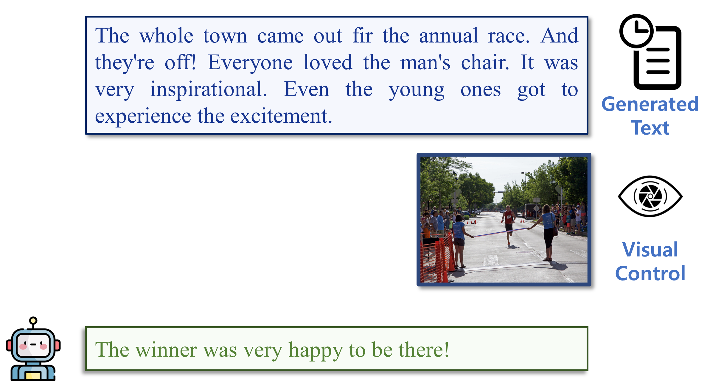

# Vision-Controllable Natural Language Generation

[Dizhan Xue](https://scholar.google.com/citations?user=V5Aeh_oAAAAJ), [Shengsheng Qian](https://scholar.google.com/citations?user=bPX5POgAAAAJ), and [Changsheng Xu](https://scholar.google.com/citations?user=hI9NRDkAAAAJ).

**MAIS, Institute of Automation, Chinese Academy of Sciences**


[](https://hits.seeyoufarm.com)

## Examples
  |   |   |
:-------------------------:|:-------------------------:
 |  
  |  
  |  
  |  


## Introduction
- Vision-Controllable Natural Language Generation (VCNLG) aims to continue natural language generation (NLG) following a peceived visual control. 
- Vision-Controllable Language Model (VCLM) aligns a frozen vsiual encoder from BLIP, a frozen textual encoder BERT, and a trained-from-scratch or pretrained generative language model (LM).
- VCLM adopt a (optional) multimodal-contextual cloud knowledge retrieval to improve edge computing AI when additional knowledge is needed.
- VCLM adopt vision-controlled reinforcement learning to constrain the trained model to follow visual controls.


## Getting Started

**1. Prepare the code and the environment**

Git clone our repository, creating a python environment and activate it via the following command

```bash
git clone https://github.com/LivXue/VCNLG.git
cd VCNLG
conda env create -f environment.yml
conda activate vcnlg
```

We adopt ViT pretrained by [BLIP](https://github.com/salesforce/BLIP) to extract visual features. Download the [weights](https://storage.googleapis.com/sfr-vision-language-research/BLIP/models/model_large.pth) of BLIP w/ ViT-L and save the file to `visual_feature_extraction/checkpoints/model_large.pth`


**2. Prepare the datasets**

### VIST-E [[Link]](https://visionandlanguage.net/VIST/dataset.html)

Download *SIS-with-labels.tar.gz*, *train_split.(0-12).tar.gz*, *val_images.tar.gz*, *test_images.tar.gz*  and unzip them into `data/VIST-E`. 

__Note:__ There should be *train.story-in-sequence.json*, *val.story-in-sequence.json*, *test.story-in-sequence.json* in `data/VIST-E/` and *image_id.jpg/png* in `data/VIST-E/images/`.

Then, run

```bash
python visual_feature_extraction/extract_fea_img.py --input_dir data/VIST-E/images --output_dir data/VIST-E/ViT_features --device <your device>
```

to extract the ViT features of images.

Then, run

```bash
python data/VIST-E/prepare_data.py --images_directory data/VIST-E/ViT_features --device <your device>
```

to generate the story files. 

Finally, run

```bash
python data/VIST-E/extract_clip_feature.py --input_dir data/VIST-E/images --output_dir data/VIST-E/clip_features
```
to generate clip features.

__Note:__ There should be *story_train.json*, *story_val.json*, *story_test.json* in `data/VIST-E/`, *<image_id>.npy* in `data/VIST-E/ViT_features/`, and *<image_id>.npy* in `data/VIST-E/clip_features/`.

### LSMDC-E [[Link]](https://sites.google.com/site/describingmovies/home) 

Download LSMDC 2021 version (*task1_2021.zip*, *MPIIMD_downloadLinks.txt*, *MVADaligned_downloadLinks.txt*) and unzip them into `data/LSMDC-E`. 

__NOTE__: Due to LSMDC agreement, we cannot share data to any third-party.

__Note:__ There should be *LSMDC16_annos_training_someone.csv*, *LSMDC16_annos_val_someone.csv*, *LSMDC16_annos_test_someone.csv*, *MPIIMD_downloadLinks.txt*, *MVADaligned_downloadLinks.txt* in `data/LSMDC-E/`.

Then, merge *MPIIMD_downloadLinks.txt* and *MVADaligned_downloadLinks.txt* to a *download_video_urls.txt* file, modify the user name and password to LSMDC in `data/LSMDC-E/generate_clips.py` and run 

```bash
python data/LSMDC-E/generate_clips.py --output_path data/LSMDC-E/videos --user_name <your user name to LSMDC> --password <your password to LSMDC>
```

to download videos and save resampled frames in to `data/LSMDC-E/videos`.

Then, run

```bash
python visual_feature_extraction/extract_fea_video.py --input_dir data/LSMDC-E/videos --output_dir data/LSMDC-E/ViT_features --device <your device>
```
to extract the ViT features of video frames.

Then, run

```bash
python data/LSMDC-E/prepare_data.py --input_path data/LSMDC-E
```

to generate the story files.

Finally, run

```bash
python data/LSMDC-E/extract_clip_feature_video.py --input_dir data/LSMDC-E/videos --output_dir data/LSMDC-E/clip_features
```
to generate clip features.

__Note:__ There should be *story_train.json*, *story_val.json*, *story_test.json* in `data/LSMDC-E/`, *<video_id>.npy* in `data/LSMDC-E/ViT_features/`, and *<video_id>.npy* in `data/LSMDC-E/clip_features/`.

**3. (Optional) Fetch Textual Knowledge**

Download the code and pretrained checkpoints of [mPLUG-Owl](https://github.com/X-PLUG/mPLUG-Owl).

Then, run our script

```
python mPLUG-Owl/test_onshot.py
```

to retrieve knowledge for the datasets.


## Training
Check the configs in `utils/opts.py` and run 
```bash
python train.py
```


## Launching Demo Locally

Coming soon...


<!-- < ## Citation

If you find our work or the code useful, please consider cite our paper using:
```bibtex

```
-->

## License
This repository is under [BSD 3-Clause License](LICENSE.md).

